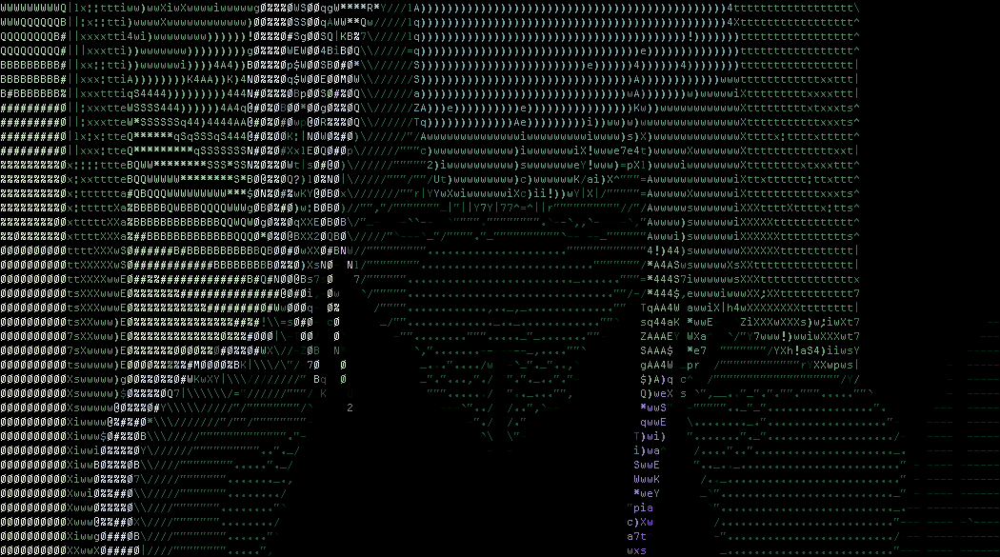

<h3 align="center"><strong>
"I've never wanted any of this. You never had to save me, all I've ever wanted is for you to live."
</strong></h3>

  
  
  

---

### About me

The name's mirza (short, miru) and I am a graduated CS student from le University of Nottingham Malaysia. I code here and there, but I mainly would like to focus on research and learning new things.

Check out my rice:  
 
moree deeets here: https://github.com/ybmirz/dotfiles  

 

- 🔭 I’m currently working on **various projects** as software engineer, employed at an IoT company based in Malaysia, with other side projects - most notably [OtakOtak.ai!](https://otakotak.ai); riding the humungous waves of llm development, I've been intrigued in the idea of providing the same value consultants and analysts provide for big enterprise, to the smaller underserved SMEs. Generally, I believe the beginning of improvement is to measure - the same for businesses, they can grow better when they can (and know how to) measure.
- One of my proudest work is on **Nott-A-Student** under **[UNM's Computer Science Society](https://github.com/UoN-Computer-Science-Society)**. Running the society with various society projects, and utilising it as a platform to get juniors started in their developer journey. (I ran it like it's my startup :D). It gave me an introduction to team building, leadership and everything extra - the pain and sweat of execution from idea.
- 🌱 I’m currently learning **Go**, and **React Native**, but I've been a generalist to all sorts of technologies, from the web to machine learning - since I'm just so enthusiastic at the idea that we made intelligence (or atleast a form of it) from sand. Aspiring to work on a quantum computer, but going to stick with quantum algorithms development and research for now 🤓
- 📫 How to reach me:  `xenonial` or  or 

---

<!--START_SECTION:waka-->

<!--END_SECTION:waka-->
